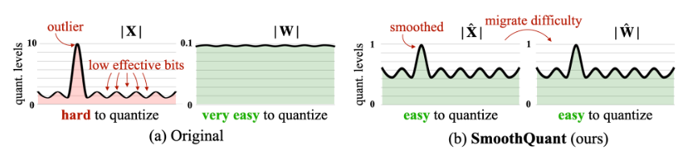

<table class="sphinxhide" width="100%">
 <tr width="100%">
    <td align="center"><h1>Ryzen™ AI Tutorials</h1>
    </td>
 </tr>
</table>

# Chatbot with Ryzen AI 

AMD [Ryzen™ AI](https://ryzenai.docs.amd.com/en/latest/index.html) brings the power of personal computing closer to you on an AI PC, unlocking a whole new level of efficiencies for work, collaboration, and innovation. It comes with a dedicated AI accelerator called AIE integrated on-chip with the CPU cores. The AMD Ryzen™ AI Software SDK enables developers to take machine learning models trained in PyTorch or TensorFlow and run them on laptops powered by Ryzen AI which can intelligently optimizes tasks and workloads, freeing-up CPU and GPU resources, and ensuring optimal performance at lower power.

AMD Ryzen™ AI Software includes the tools and runtime libraries for optimizing and deploying AI inference on AIE. Installation is as simple as download and a single click. Additionally, it comes with various pre-quantized ready to deplay models on Hugging Face [model zoo](https://huggingface.co/models?other=RyzenAI). Developers can get started in building their applications within minutes unleashing the full potential of AI acceleration on Ryzen AI PCs.

In this blog we will download a pre-trained OPT1.3B model from Hugging Face and deploy it on Ryzen AI laptop with a Chatbot app in a simple three step process.

### Ryzen AI Software 
- Version:      Ryzen AI Software Platform v1.0 or v1.0.1 or v1.1
- Support:      AMD Ryzen 7040U, 7040HS series mobile processors with Windows 11 OS.
- Last update:  Dec. 2023

## Table of Contents

[ Prerequisites](#prerequisites)

[ Step-1: Download pre-trained opt-1.3b Model from Hugging Face](#Step-1-download-pre-trained-model-from-hugging-face)

[ Step-2: Quantize the downloaded model from FP32 to Int8](#Step-2-quantize-the-downloaded-model-from-FP32-to-Int8)

[ Step-3: Deploy Chatbot app with the model](#Step-3-deploy-chatbot-app-with-the-model)

[License](#license)

## Prerequisites

First we will make sure that the following prerequisites are met.
- AMD Ryzen AI laptop with windows 11 OS
- Anaconda, install if needed from [here](https://docs.anaconda.com/free/anaconda/install/windows/e)
- Latest Ryzen AI AIE driver and Software. Follow the simpple single click installation [here](https://ryzenai.docs.amd.com/en/latest/)

Clone this repo or download and extract Chatbot-with-RyzenAI-1.0.zip into the root directory where you have installed the Ryzen AI SW. In my case it is C:\User\ahoq\RyzenAI\
```
cd C:\Users\ahoq\RyzenAI\
git clone alimulh/Chatbot-with-RyzenAI-1.0
# Activate the conda environment created when RyzenAI was installed. In my case it was ryzenai-1.0-20231204-120522
conda activate ryzenai-1.0-20231204-120522
#install gradio pkage using requirements.txt file. The browser app for the Chatbot is created with Gradio
pip install -r requirements.txt
# initialize PATHs
setup.bat
```
Now we are ready to create Chatbot with 3 steps, shall we?

## Step-1 Download pre trained Model from Hugging face
In this step we will download a pre-trained Opt-1.3b model from Hugging face. You can modify the run.py script to download a pre-trained model from your own or your company repository. Opt-1.3b is a large, ~4GB model. Download time depends on internet speed. In my case it took ~6 minutes.
```
cd Chatbot-with-RyzenAI-1.0\
python run.py --model_name opt-1.3b --download
```
The downloaded model saves in the subdirectory \opt-1.3b_pretrained_fp32\ as shouwn below,


## Step-2 Quantize the downloaded model from FP32 to Int8
Once the download is complete we quantize the model using following command,

```
python run.py --model_name opt-1.3b --quantize
```
Quantization is a two steps process. First the FP32 model is smooth quantized to reduce accuracy loss during quantization. It essentially identifies the outliers in the activation coefficients and conditions the weights accordingly. Hence, during quantization if the outliers are dropped the error introduction is negligible. The Smooth Quant is invented by one of AMD's pioneer research Dr. Song Han, he is a professor at MIT EECS department. Below is a visual presentation of how smooth quantization technique works.



You can learn more about the Smooth quant technique [here](https://arxiv.org/pdf/2211.10438.pdf). 
After Smooth quantize the conditioned model along with config.json files are saved in the 'model_onnx' folder in the opt-1.3b_smoothquant folder. Here is a screen capture of Smooth quantization log:


Smooth quantization takes ~30 secornds to completed. Once done the Optimum quantizer is used to quantize the model into int8. The int8 quantized model is then saved in the folder 'model_onnx_int8' inside the 'opt-1.3b_smoothquant folder. Quantization is an off line process. It take about 2-3 minutes to complete and needs to be done once. Here is a screen capture of Int8 quantization log:


## Step-3 Evaluate the model and Deploy it with the Chatbot App
Next, we evaluate the quantized model and run it targeting AIE with the following command. Notice the model path is set to the location where we saved the int8 quatized model in the last step

```
python run.py --model_name opt-1.3b --target aie --local_path .\opt-1.3b_smoothquant\model_onnx_int8\
```

At the first run, the model is automatically compiled by an inline compiler. Compilation is also a two-step process, first the compiler identifies the layer those can be executed in the AIE and the once need to be executed in the CPU. Then it creates sets of subgraphs. One set for AIE and the other set for CPU. Finally, it creates instruction sets for each of the subgraphs targeting respective execution unit. These instructions are executed by two ONNX execution providers (EP), one for CPU and one for the AIE. After first compilation, the compiled model is saved in the cache so in the subsequent deployment it avoids compilation.
Here is a screen capture where the model information was printed during the compilation flow. 


After the compilation the model runs on AIE & CPU. A test prompt was applied. The response from the LLM shows correct answers. Keep in mind that we downloaded and deployed a publicly available pretrained model. So its accuracy is subjective and may not be always as expected. We strongly recommend finetuning a publicly available models before production deployment.
Here is the screen capture of the test prompt and the response:


Now lets launch the Chatbot with the int8 quantized model saved int he path \opt-1.3b-smooothquant\model_onnx_int8\
```
python gradio_app\opt_demo_gui.py --model_file .\opt-1.3b_smoothquant\model_onnx_int8\
```
The chatbot app runs on localhost on port 1234. 


Lets open a brawser and sarf to http://localhost:1234. Set the max_output_token=64 and enter the prompt "What does AMD do?" in the Input_text. The chatbot outputs the response as shown below. It also calculates the KPI as token/sec. In my run it was ~4.7 tkn/sec. 


Output on the command prompt also shows the steps for each token generation flow. Shown below. 


## License

The MIT License (MIT)

Copyright (c) 2022 Advanced Micro Devices, Inc.

Permission is hereby granted, free of charge, to any person obtaining a copy of this software and associated documentation files (the "Software"), to deal in the Software without restriction, including without limitation the rights to use, copy, modify, merge, publish, distribute, sublicense, and/or sell copies of the Software, and to permit persons to whom the Software is furnished to do so, subject to the following conditions:

The above copyright notice and this permission notice shall be included in all copies or substantial portions of the Software.

THE SOFTWARE IS PROVIDED "AS IS", WITHOUT WARRANTY OF ANY KIND, EXPRESS OR IMPLIED, INCLUDING BUT NOT LIMITED TO THE WARRANTIES OF MERCHANTABILITY, FITNESS FOR A PARTICULAR PURPOSE AND NONINFRINGEMENT. IN NO EVENT SHALL THE AUTHORS OR COPYRIGHT HOLDERS BE LIABLE FOR ANY CLAIM, DAMAGES OR OTHER LIABILITY, WHETHER IN AN ACTION OF CONTRACT, TORT OR OTHERWISE, ARISING FROM, OUT OF OR IN CONNECTION WITH THE SOFTWARE OR THE USE OR OTHER DEALINGS IN THE SOFTWARE.
