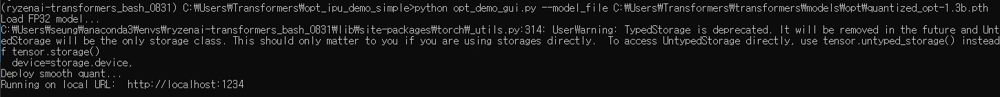
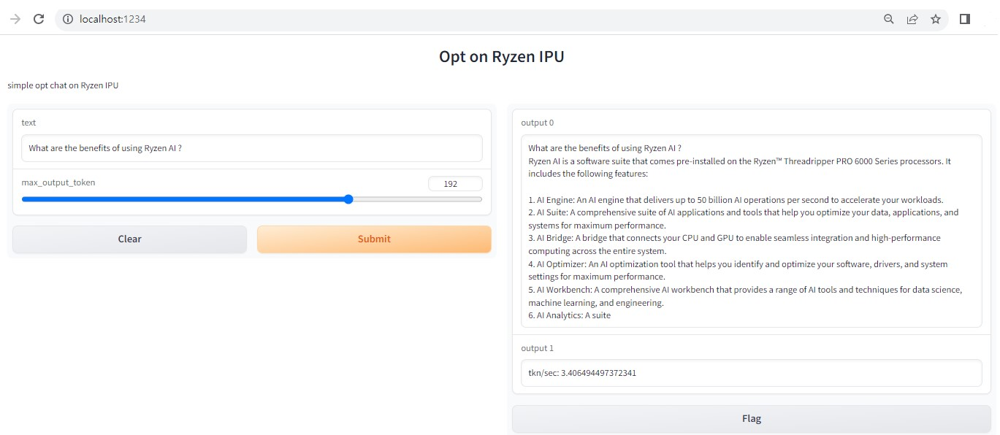

# Simple OPT demo on Ryzen AI IPU
Minimal opt demo

## Prerequisite
Follow instructions in the Ryzen AI IPU transformers repo (https://gitenterprise.xilinx.com/VitisAI/transformers/tree/release_2) 

## Launch simple opt demo
In the conda environment created from the above prerequiste step, launch the demo app and access the demo via web browser
```bash
pip install gradio
python opt_demo_gui.py --model_file C:\Users\Transformers\transformers\models\opt\quantized_opt-1.3b.pth
```

<a ></a>

Access the demo web server from the web browser(localhost:1234)

<a ></a>